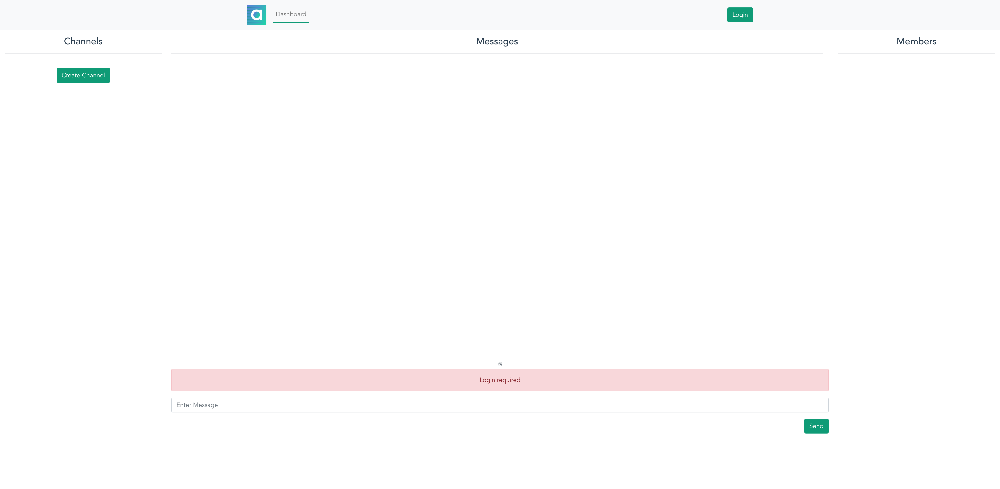

# Chat App Demo
This chat app demo consist of 4 main components such as:

- Apache Kafka.
- Event processing service written using `Spring Boot`.
- Zilla API gateway that hosts both app web interface and APIs.
- Chat app UI

## Requirements

* [Node.js](http://nodejs.org/)
* [Docker](https://www.docker.com/)


## Apache Kafka
Apache Kafka will server both as event streaming source and database table to store information about users and
channels. Following topics will be created:
- `channels` - Stores information about channels. This logcompacted topic which means only latest snapshot will be store.
- `users` - Stores information about users. This logcompacted topic which means only latest snapshot will be store.
- `subscriptions` - This is also logcompacted topic which store latest information about user subscription to a channel.
- `commands` - This topics get populated by Zilla API Gateway for the event processing service to process commands
  such as `SubscribeCommand`, `Unsbscribe command`.
- `messages` - This topics stores all messages across different channels and users.

## Event Processing Service
This service is responsible to processes commands such as `SubscribeCommand`, `Unsbscribe command` and produce messages
to the appropriate topics.

### Build the service
All components are launched from docker stack defined in `stack.yaml` however, chat-service is reference to
`image: "chat-service:latest"` which should be build locally. Please run the below command to build image.

```shell
cd service
./mvnw clean install
cd ..
```
The above command will generate `chat-service:latest` image.

## Chat App UI
This app is build using `Vue.js` and `BootstrapVue` frameworks and contains user authentication component as well
which uses Auth0 platform.

### Build

```shell
cd app
yarn install
yarn run build
cd ..
```

The above command will generate `dist` folder with all the necessary files to be hosted by Zilla API Gateway.

## Zilla API Gateway
Zilla API Gateway will be hosting both app UI and APIs. Following endpoints are configured in `zilla.jon`

| Protocol | Method | Endpoint                | Topic         |
|----------|--------|-------------------------|---------------|
| SSE      | GET    | /channels/*/messages    | messages      |
| SSE      | GET    | /channels/*/members     | subscriptions |
| SSE      | GET    | /channels               | channels      |
| HTTP     | POST   | /channels/{id}/messages | messages      |
| HTTP     | POST   | /channels               | channels      |
| HTTP     | GET    | /channels               | channels      |
| HTTP     | GET    | /channels/{id}          | channels      |
| HTTP     | GET    | /subscription/subscribe | commands      |
| HTTP     | POST   | /users                  | users         |
| HTTP     | PUT    | /users/{id}             | users         |
| HTTP     | GET    | /users                  | users         |
| HTTP     | GET    | /users/{id}             | users         |


## Launch the stack
Run following command to launch the stack:

```shell
docker stack deploy -c stack.yml example --resolve-image never
```

```shell
#Output
Creating network example_net0
Creating service example_kafka
Creating service example_init-kafka
Creating service example_chat-service
Creating service example_zilla
```

# Test
Make sure that `example_kafka` started successfully and all topics were created in `example_init-kafka`.

Navigate to `http://localhost:8080/#/` in the browser.



Click on login and use one of the option to authenticate. Happy testing!


